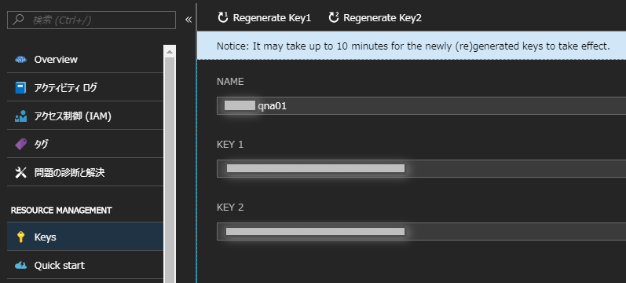
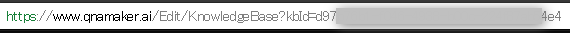

# QnA Maker と Cognitive Services

## QnA Maker
- [QnA Maker（マイクロソフト公式サイト）](https://azure.microsoft.com/ja-jp/services/cognitive-services/qna-maker/)
- [QnA Maker ドキュメント（マイクロソフト公式サイト）](https://docs.microsoft.com/ja-jp/azure/cognitive-services/QnAMaker/)

Azure の Coginitive Services のひとつ。  
- 既存のコンテンツを使って、自然な会話形式でユーザーに回答する単純な Q&A ができる
- FAQ の URL、構造化されたドキュメント、製品マニュアルを取り込み、考えられるあらゆる質問とその回答のペアをコンテンツから抽出する
- ボットのテストとトレーニングは、使い慣れたチャット インターフェイスを使用して簡単に行うことができる
- QnA Maker を他の API (Language Understanding サービス、Speech API など) とシームレスに統合することにより、さまざまな方法でユーザーからの質問を解釈して回答することができる

価格
|レベル|機能|料金|
|--|--|--|
|Free|3 managed documents; up to 1 MB each|¥0|
|Standars|No limit on the number of managed documents|¥1,120/月|

上記の価格設定とは別に、以下のリソースに対しても支払いが必要となる。QnA Maker リソースを作成すると、自分のAzureサブスクリプションでデータとランタイムをホストすることになるが、これらは Azure Search と App Service によって提供される。
|リソース|機能|料金|
|--|--|--|
|Azure App Service (for the runtime)|[More information](https://azure.microsoft.com/ja-jp/services/app-service/)|[Pricing](https://azure.microsoft.com/ja-jp/pricing/details/app-service/)|
|Azure Search (for the data)|[More information](https://azure.microsoft.com/ja-jp/services/search/)|[Pricing](https://azure.microsoft.com/ja-jp/pricing/details/search/)|

### 作成
ポータルから「リソースの作成」で「QnA Maker」で検索して作成する。

## APIの作成（C#編）
### キーの取得
QnA Makerをリソースとして選択したAPIアカウントが必要になるので、Azureポータルポータルの[リソース管理]で[キー]を選択し、どこかにコピー＆ペーストしておく。  
キーは２つ表示されるが、どちらか一方だけ(KEY1だけ)でOK。



### ナレッジベースの生成
QnAMakerのナレッジベースを生成するプログラムを作成する。

1. .Net Frameowrk のコンソールアプリケーションプロジェクトを作成
2. プロジェクトを作成したら、NuGetから「Newtonsoft.JSON」をインストール
3. `CreateQnA.cs` を作成し、以下のコードに置き換える  
[CreateQnA.cs](https://github.com/nonko8/qnamaker-cognitive/blob/master/src/QnAMaker/QnAMaker/CreateQnA.cs)
4. `key` をAzureポータルからコピーした値に置き換える

### ナレッジベース生成時のレスポンス
レスポンスはJSONで返される。最後の呼び出しが「`Succeeded`」を返した場合、ナレッジベースが正常に作成されたことを表す。トラブルシューティングを行うには、[QnA Maker APIの操作の詳細を取得する](https://westus.dev.cognitive.microsoft.com/docs/services/5a93fcf85b4ccd136866eb37/operations/operations_getoperationdetails)を参照する。

```json
Calling https://westus.api.cognitive.microsoft.com/qnamaker/v4.0/knowledgebases/create.
{
  "operationState": "NotStarted",
  "createdTimestamp": "2018-06-25T10:30:15Z",
  "lastActionTimestamp": "2018-06-25T10:30:15Z",
  "userId": "0d85ec291c204197a70cfec51725cd22",
  "operationId": "d9d40918-01bd-49f4-88b4-129fbc434c94"
}
Calling https://westus.api.cognitive.microsoft.com/qnamaker/v4.0/operations/d9d40918-01bd-49f4-88b4-129fbc434c94.
{
  "operationState": "Running",
  "createdTimestamp": "2018-06-25T10:30:15Z",
  "lastActionTimestamp": "2018-06-25T10:30:15Z",
  "userId": "0d85ec291c184197a70cfeb51025cd22",
  "operationId": "d9d40918-01bd-49f4-88b4-129fbc434c94"
}
Waiting 30 seconds...
Calling https://westus.api.cognitive.microsoft.com/qnamaker/v4.0/operations/d9d40918-01bd-49f4-88b4-129fbc434c94.
{
  "operationState": "Running",
  "createdTimestamp": "2018-06-25T10:30:15Z",
  "lastActionTimestamp": "2018-06-25T10:30:15Z",
  "userId": "0d85ec221c284197a70gfeb51725cd22",
  "operationId": "d9d40918-01bd-49f4-88b4-129fbc434c94"
}
Waiting 30 seconds...
Calling https://westus.api.cognitive.microsoft.com/qnamaker/v4.0/operations/d9d40918-01bd-49f4-88b4-129fbc434c94.
{
  "operationState": "Succeeded",
  "createdTimestamp": "2018-06-25T10:30:15Z",
  "lastActionTimestamp": "2018-06-25T10:30:51Z",
  "resourceLocation": "/knowledgebases/1d9eb2a1-de2a-4709-91b2-f6ea8afb6fb9",
  "userId": "0d85ec294c284197a70cfeb51775cd22",
  "operationId": "d9d40918-01bd-49f4-88b4-129fbc434c94"
}
Press any key to continue.
```

ナレッジベースが作成されると、[QnA Makerポータル](https://www.qnamaker.ai/Home/MyServices)の[ナレッジベース]ページで、該当するナレッジベース名（QnA Maker FAQなど）を選択すると、ナレッジベースを表示できる。

### ナレッジベースの更新
QnAMakerのナレッジベースを更新するプログラムを作成する。上記で作成したプロジェクトに新規クラスを追加して実装する。

1. `UpdateQnA.cs` を作成し、以下のコードに置き換える  
[UpdateQnA.cs](https://github.com/nonko8/qnamaker-cognitive/blob/master/src/QnAMaker/QnAMaker/UpdateQnA.cs)
2. `kbid` を有効なナレッジベースIDに置き換える。[QnA Makerのナレッジベース](https://www.qnamaker.ai/Home/MyServices)にアクセスして、次のようにURLの 'kbid ='以降の値をセットする。 


### ナレッジベース更新時のレスポンス
レスポンスはJSONで返される。最後の呼び出しが「`Succeeded`」を返した場合、ナレッジベースが正常に更新されたことを表す。トラブルシューティングを行うには、[QnA Maker APIの操作の詳細を取得する](https://westus.dev.cognitive.microsoft.com/docs/services/5a93fcf85b4ccd136866eb37/operations/operations_getoperationdetails)を参照する。

```json
{
  "operationState": "NotStarted",
  "createdTimestamp": "2018-04-13T01:49:48Z",
  "lastActionTimestamp": "2018-04-13T01:49:48Z",
  "userId": "2280ef5917bb4ebfa1aae41fb1cebb4a",
  "operationId": "5156f64e-e31d-4638-ad7c-a2bdd7f41658"
}
...
{
  "operationState": "Succeeded",
  "createdTimestamp": "2018-04-13T01:49:48Z",
  "lastActionTimestamp": "2018-04-13T01:49:50Z",
  "resourceLocation": "/knowledgebases/140a46f3-b248-4f1b-9349-614bfd6e5563",
  "userId": "2280ef5917bb4ebfa1aae41fb1cebb4a",
  "operationId": "5156f64e-e31d-4638-ad7c-a2bdd7f41658"
}
Press any key to continue.
```

### ナレッジベースの公開
QnAMakerのナレッジベースを公開するプログラムを作成する。上記で作成したプロジェクトに新規クラスを追加して実装する。

1. `PublishQnA.cs` を作成し、以下のコードに置き換える
[PublishQnA.cs](https://github.com/nonko8/qnamaker-cognitive/blob/master/src/QnAMaker/QnAMaker/PublishQnA.cs)
2. `key` をAzureポータルからコピーした値に置き換える
3. `kbid` を有効なナレッジベースIDに置き換える。[QnA Makerのナレッジベース](https://www.qnamaker.ai/Home/MyServices)にアクセスして、次のようにURLの 'kbid ='以降の値をセットする。  


### ナレッジベース更新時のレスポンス
レスポンスはJSONで返される。「`Success`」を返した場合、ナレッジベースが正常に処理されたことを表す。

```json
{
  "result": "Success."
}
```

