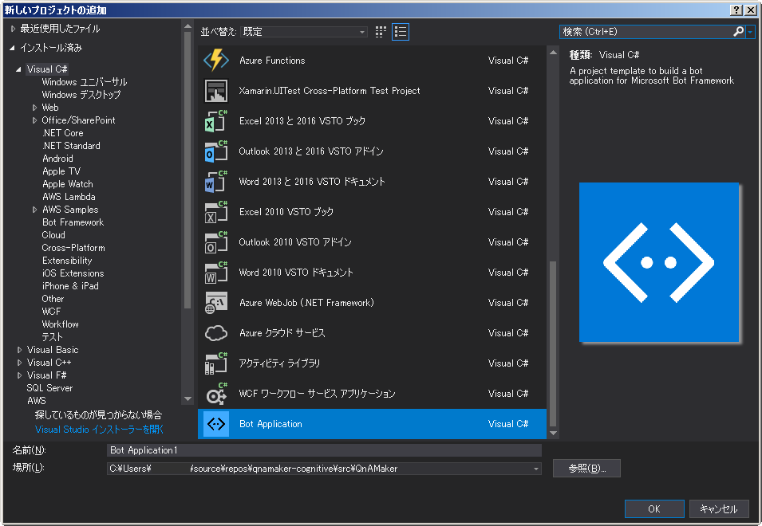
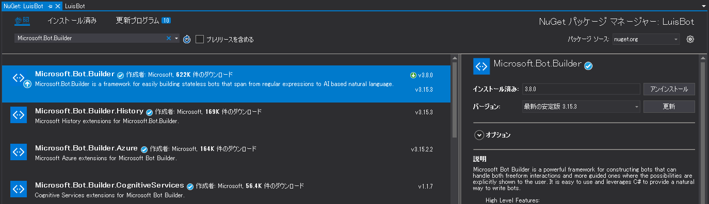
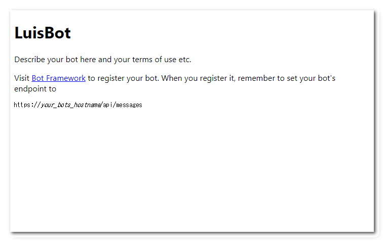
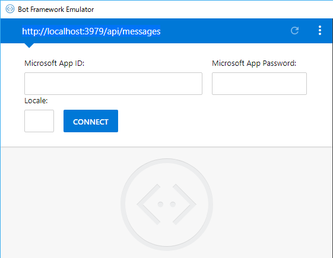
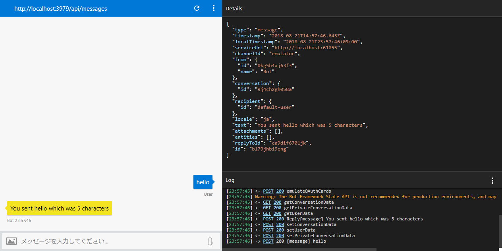
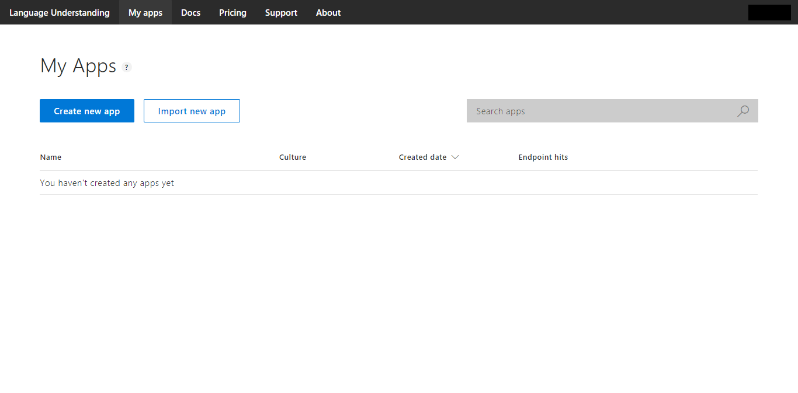
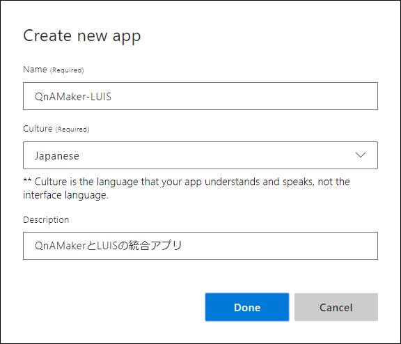
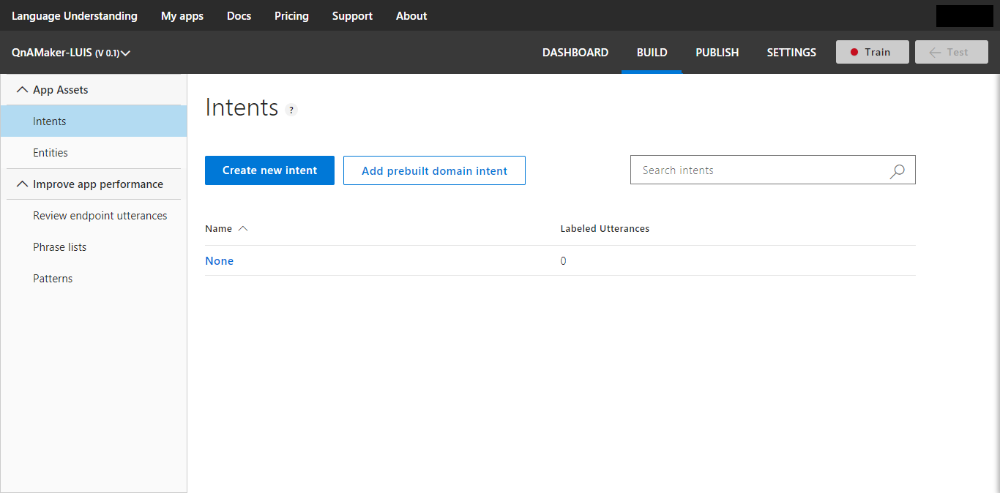
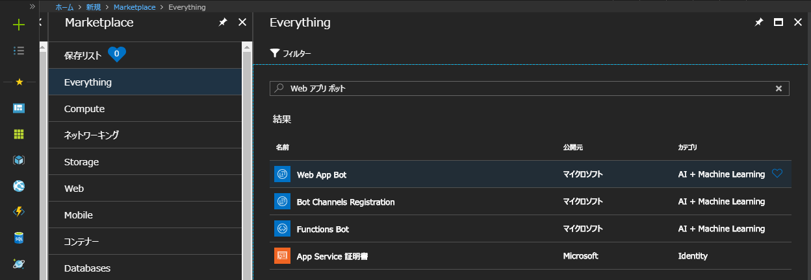
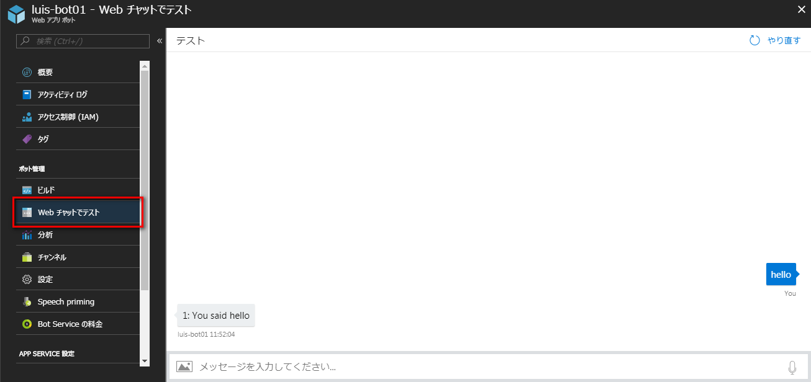

# QnA Maker と Cognitive Services

## QnA Maker
- [QnA Maker（マイクロソフト公式サイト）](https://azure.microsoft.com/ja-jp/services/cognitive-services/qna-maker/)
- [QnA Maker ドキュメント（マイクロソフト公式サイト）](https://docs.microsoft.com/ja-jp/azure/cognitive-services/QnAMaker/)

Azure の Coginitive Services のひとつ。  
- 既存のコンテンツを使って、自然な会話形式でユーザーに回答する単純な Q&A ができる
- FAQ の URL、構造化されたドキュメント、製品マニュアルを取り込み、考えられるあらゆる質問とその回答のペアをコンテンツから抽出する
- ボットのテストとトレーニングは、使い慣れたチャット インターフェイスを使用して簡単に行うことができる
- QnA Maker を他の API (Language Understanding サービス、Speech API など) とシームレスに統合することにより、さまざまな方法でユーザーからの質問を解釈して回答することができる

価格

|レベル|機能|料金|
|--|--|--|
|Free|3 managed documents; up to 1 MB each|¥0|
|Standars|No limit on the number of managed documents|¥1,120/月|

上記の価格設定とは別に、以下のリソースに対しても支払いが必要となる。QnA Maker リソースを作成すると、自分のAzureサブスクリプションでデータとランタイムをホストすることになるが、これらは Azure Search と App Service によって提供される。

|リソース|機能|料金|
|--|--|--|
|Azure App Service (for the runtime)|[More information](https://azure.microsoft.com/ja-jp/services/app-service/)|[Pricing](https://azure.microsoft.com/ja-jp/pricing/details/app-service/)|
|Azure Search (for the data)|[More information](https://azure.microsoft.com/ja-jp/services/search/)|[Pricing](https://azure.microsoft.com/ja-jp/pricing/details/search/)|

### 作成
ポータルから「リソースの作成」で「QnA Maker」で検索して作成する。

## APIの作成（C#編）
### キーの取得
QnA Makerをリソースとして選択したAPIアカウントが必要になるので、Azureポータルポータルの[リソース管理]で[キー]を選択し、どこかにコピー＆ペーストしておく。  
キーは２つ表示されるが、どちらか一方だけ(KEY1だけ)でOK。


### ナレッジベースの生成
QnAMakerのナレッジベースを生成するプログラムを作成する。

1. .Net Frameowrk のコンソールアプリケーションプロジェクトを作成
2. プロジェクトを作成したら、NuGetから「Newtonsoft.JSON」をインストール
3. `CreateQnA.cs` を作成し、以下のコードに置き換える  
[CreateQnA.cs](https://github.com/nonko8/qnamaker-cognitive/blob/master/src/QnAMaker/QnAMaker/CreateQnA.cs)
4. `key` をAzureポータルからコピーした値に置き換える

### ナレッジベース生成時のレスポンス
レスポンスはJSONで返される。最後の呼び出しが「`Succeeded`」を返した場合、ナレッジベースが正常に作成されたことを表す。トラブルシューティングを行うには、[QnA Maker APIの操作の詳細を取得する](https://westus.dev.cognitive.microsoft.com/docs/services/5a93fcf85b4ccd136866eb37/operations/operations_getoperationdetails)を参照する。

```json
Calling https://westus.api.cognitive.microsoft.com/qnamaker/v4.0/knowledgebases/create.
{
  "operationState": "NotStarted",
  "createdTimestamp": "2018-06-25T10:30:15Z",
  "lastActionTimestamp": "2018-06-25T10:30:15Z",
  "userId": "0d85ec291c204197a70cfec51725cd22",
  "operationId": "d9d40918-01bd-49f4-88b4-129fbc434c94"
}
Calling https://westus.api.cognitive.microsoft.com/qnamaker/v4.0/operations/d9d40918-01bd-49f4-88b4-129fbc434c94.
{
  "operationState": "Running",
  "createdTimestamp": "2018-06-25T10:30:15Z",
  "lastActionTimestamp": "2018-06-25T10:30:15Z",
  "userId": "0d85ec291c184197a70cfeb51025cd22",
  "operationId": "d9d40918-01bd-49f4-88b4-129fbc434c94"
}
Waiting 30 seconds...
Calling https://westus.api.cognitive.microsoft.com/qnamaker/v4.0/operations/d9d40918-01bd-49f4-88b4-129fbc434c94.
{
  "operationState": "Running",
  "createdTimestamp": "2018-06-25T10:30:15Z",
  "lastActionTimestamp": "2018-06-25T10:30:15Z",
  "userId": "0d85ec221c284197a70gfeb51725cd22",
  "operationId": "d9d40918-01bd-49f4-88b4-129fbc434c94"
}
Waiting 30 seconds...
Calling https://westus.api.cognitive.microsoft.com/qnamaker/v4.0/operations/d9d40918-01bd-49f4-88b4-129fbc434c94.
{
  "operationState": "Succeeded",
  "createdTimestamp": "2018-06-25T10:30:15Z",
  "lastActionTimestamp": "2018-06-25T10:30:51Z",
  "resourceLocation": "/knowledgebases/1d9eb2a1-de2a-4709-91b2-f6ea8afb6fb9",
  "userId": "0d85ec294c284197a70cfeb51775cd22",
  "operationId": "d9d40918-01bd-49f4-88b4-129fbc434c94"
}
Press any key to continue.
```

ナレッジベースが作成されると、[QnA Makerポータル](https://www.qnamaker.ai/Home/MyServices)の[ナレッジベース]ページで、該当するナレッジベース名（QnA Maker FAQなど）を選択すると、ナレッジベースを表示できる。

### ナレッジベースの更新
QnAMakerのナレッジベースを更新するプログラムを作成する。上記で作成したプロジェクトに新規クラスを追加して実装する。

1. `UpdateQnA.cs` を作成し、以下のコードに置き換える  
[UpdateQnA.cs](https://github.com/nonko8/qnamaker-cognitive/blob/master/src/QnAMaker/QnAMaker/UpdateQnA.cs)
2. `kbid` を有効なナレッジベースIDに置き換える。[QnA Makerのナレッジベース](https://www.qnamaker.ai/Home/MyServices)にアクセスして、次のようにURLの 'kbid ='以降の値をセットする。  


### ナレッジベース更新時のレスポンス
レスポンスはJSONで返される。最後の呼び出しが「`Succeeded`」を返した場合、ナレッジベースが正常に更新されたことを表す。トラブルシューティングを行うには、[QnA Maker APIの操作の詳細を取得する](https://westus.dev.cognitive.microsoft.com/docs/services/5a93fcf85b4ccd136866eb37/operations/operations_getoperationdetails)を参照する。

```json
{
  "operationState": "NotStarted",
  "createdTimestamp": "2018-04-13T01:49:48Z",
  "lastActionTimestamp": "2018-04-13T01:49:48Z",
  "userId": "2280ef5917bb4ebfa1aae41fb1cebb4a",
  "operationId": "5156f64e-e31d-4638-ad7c-a2bdd7f41658"
}
...
{
  "operationState": "Succeeded",
  "createdTimestamp": "2018-04-13T01:49:48Z",
  "lastActionTimestamp": "2018-04-13T01:49:50Z",
  "resourceLocation": "/knowledgebases/140a46f3-b248-4f1b-9349-614bfd6e5563",
  "userId": "2280ef5917bb4ebfa1aae41fb1cebb4a",
  "operationId": "5156f64e-e31d-4638-ad7c-a2bdd7f41658"
}
Press any key to continue.
```

### ナレッジベースの公開
QnAMakerのナレッジベースを公開するプログラムを作成する。上記で作成したプロジェクトに新規クラスを追加して実装する。

1. `PublishQnA.cs` を作成し、以下のコードに置き換える
[PublishQnA.cs](https://github.com/nonko8/qnamaker-cognitive/blob/master/src/QnAMaker/QnAMaker/PublishQnA.cs)
2. `key` をAzureポータルからコピーした値に置き換える
3. `kbid` を有効なナレッジベースIDに置き換える。[QnA Makerのナレッジベース](https://www.qnamaker.ai/Home/MyServices)にアクセスして、次のようにURLの 'kbid ='以降の値をセットする。  


### ナレッジベース更新時のレスポンス
レスポンスはJSONで返される。「`Success`」を返した場合、ナレッジベースが正常に処理されたことを表す。

```json
{
  "result": "Success."
}
```

---

## Bot Frameworkの構築

Bot FRamework を開発するための設定を行う。マイクロソフト公式サイトを参照。  
> [Create a bot with the Bot Builder SDK for .NET](https://docs.microsoft.com/en-us/bot-framework/dotnet/bot-builder-dotnet-quickstart)

### 環境

- Visual Studio 2017（C#）

### 環境設定

Bot Frameworkを開発するために、Visual Studioのプロジェクトテンプレートを以下からダウンロード。
- Bot Application.  
  http://aka.ms/bf-bc-vstemplate
- Bot Controller.  
  http://aka.ms/bf-bc-vscontrollertemplate
- Bot Dialog.  
  http://aka.ms/bf-bc-vsdialogtemplate

それぞれダウンロードしたら、zip形式のままテンプレートの所定の格納先に配置。
デフォルトでは、`%USERPROFILE%\Documents\Visual Studio 2017\Templates\ProjectTemplates\Visual C#\` となっている。作成

### ボットの作成
前述のテンプレートを正しく配置されていれば、新しくプロジェクトを作成するときに、「Bot Application」が選択できるようになっている。



NuGetでパッケージの最新化をする。NuGet管理画面で「Microsoft.Bot.Builder」を検索し Bot Builder をアップデート。2018/8/21時点では、Version 3.15.3 が最新の安定版となっている。



### 実行とデバッグ
ボットプロジェクトをローカルで実行するには、エミュレータが必要。公式のエミュレータとし“botframework-emulator”が提供されているので、それをインストール。2018/8/21時点では、Version3.5.36 が最新の安定版をなっている。

- [Microsoft/BotFramework-Emulator v3.5.36](https://github.com/Microsoft/BotFramework-Emulator/releases/tag/v3.5.36)

プレビュー段階のエミュレータは、GitHubのこちらから確認可能。
- [Microsoft/BotFramework-Emulator](https://github.com/Microsoft/BotFramework-Emulator/releases)

※2018/8/21時点、32bit版のエミュレータは提供されていない。そもそも提供される予定はなかったらしいが、32bit版のリクエストが多数あったようで、対応を検討しているとのこと。from GitHub Issue

エミュレータの準備ができたら、Visual Studio で F5 (デバックの開始) で通常通りにデバック実行。ブラウザが起動して、Bot Application の画面が表示されたら、ローカルでボットが実行されていることになる。



ブラウザのURLを確認する。
```
http://localhost:3979/
```

ブラウザで上記のURLの場合、エミュレーターのエンドポイントURLは以下となる。
```
http://localhost:3979/api/messages
```



エンドポイントURLを入力したら、`Microsoft App ID` 、 `Micorsoft App Password` 、 `Locale` はブランクのままで「CONNECT」ボタンをクリック。

「hello」入力して「You sent hello which was 5 characters」と返ってくればOK。

エミュレーターには、以下のような情報が表示されている。
- 右枠：
  - Botアプリケーション内で実行されているメッセージやユーザーの情報、返答内容　(JSON形式で表示)
- 左枠
  - Botととのやりとり



リンクやメッセージをクリックすると、該当のJSONパラメータが右枠に表示される。上図は「You sent hello which was 5 characters」のレスポンスのJSON。

## Azure へデプロイするための環境設定
Botアプリケーションは、Azure App Serviceで動作する。ローカルからAzure App Serviceにデプロイする方法は以下の方法がある。

1. Visual Studio から Azure App Service へ直接発行。手順は公式サイトを参照。  
[ボットを Bot Service に発行する](https://docs.microsoft.com/ja-jp/azure/bot-service/bot-service-continuous-deployment?view=azure-bot-service-3.0)  

2. Azure Web Appのデプロイオプションで発行  
Azure App Serviceを先に作成し、リポジトリと連携させる方法。ソースコード管理と連携しているので、リポジトリにPushするたびにデプロイされる。設定については、公式サイトを参照。  
[Azure App Service へのローカル Git デプロイ](https://docs.microsoft.com/ja-jp/azure/app-service/app-service-deploy-local-git)  
[Azure App Service への継続的デプロイ](https://docs.microsoft.com/ja-jp/azure/app-service/app-service-continuous-deployment#deploy-continuously-from-github)

3. Visual Studio Team ServicesでCI/CDパイプライン  
VSTSのGit Ripositoryでソースコード管理をしている場合には、VSTSからビルド・デプロイ可能。設定については、公式サイトを参照。  
[Azure App Service への継続的デプロイ](https://docs.microsoft.com/ja-jp/azure/app-service/app-service-continuous-deployment#deploy-continuously-from-vsts)

## AzureにデプロイしたBotのテスト
ローカルで実行した方法と同様に、Azure App Service にデプロイしたBotアプリケーションもエミュレーターを起動してテストをできる。

Azure App ServiceのURLに"/api/messages"を付与したものエンドポイントURLにすればつながるはず。

---

## QnA Maker と LUIS
参考サイト：  
[QnA Maker と LUIS の統合によるナレッジ ベースの配信](https://docs.microsoft.com/ja-jp/azure/cognitive-services/QnAMaker/tutorials/integrate-qnamaker-luis)

<blockquote>
QnA Maker ナレッジ ベースは、大きくなるにつれて、単一のモノリシックなセットとして維持することが難しくなり、より小さな論理的なチャンクにナレッジ ベースを分割する必要があります。
QnA Maker には複数のナレッジ ベースを簡単に作成できますが、入力された質問を適切なナレッジ ベースにルーティングするためには、何らかのロジックが必要となります。 これは LUIS を使用して実行できます。

**アーキテクチャ**


</blockquote>

## 事前にやること
- [QnA Maker](https://qnamaker.ai/) でナレッジ ベースを作成しておく
  - [ナレッジベースの作り方](README.md)
- [LUIS ポータル](https://www.luis.ai/) からアプリを作成しておく
  - [LUISアプリの作り方](https://docs.microsoft.com/ja-jp/azure/cognitive-services/LUIS/luis-how-to-start-new-app)  
    「Create new app」をクリック
      
    いろいろ入力して「Done」をクリック
    
    作成されるとこのような画面が表示される
    
- ナレッジベースとLUISアプリを発行する

## Bot Service での Language Understanding ボットの作成（LUISポータルからアプリの作成）

1. Azure ポータル で、「新しいリソースの作成」を選択

2. 検索ボックスで、「**Web アプリ ボット**」と検索し、「**Web App Bot**」を選択  


3. Bot Service の設定ブレードが表示されるので、必要な情報を指定し、[作成] をクリック。 これによって、ボット サービスと LUIS アプリが作成され、Azure にデプロイされる  
    |項目名|説明|
    |--|--|
    |アプリ名|ボットの名前を設定|
    |ボット テンプレート|**Language Understanding (C#)** テンプレートを選択|
    |LUIS アプリの場所|アプリが作成されるオーサリング リージョンを選択|

4. ボットがデプロイされたら、「Web チャットでのテスト」をクリックして、Web チャット ウィンドウを開く

5. Web チャットに「hello」と入力してみる


6. 上図のように「You said hello」と返ってくればOK！


NOTE：以降は下書き

7. `trained` と `published` で LUIS app ID と key を生成。

## QnA Maker + LUIS ボットの作成


## ボットへの LUIS アプリの接続

「アプリケーションの設定」を開き、以下のアプリケーション設定を編集する